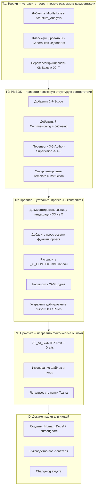
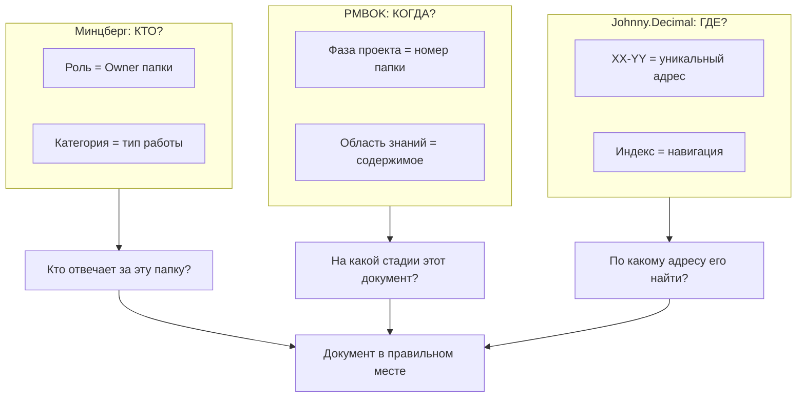

# Аудит правил Galt на соответствие Минцберг + PMBOK + Johnny.Decimal

## Методология

Проверены 7 документов v0.3 и `.cursorrules` на соответствие трём теоретическим рамкам, заявленным в [Structure_Analysis.md](01-Management/01-05-Structure-Management/v0.3/Structure_Analysis.md):

- **Минцберг** -- модель "Пяти (шести) частей организации"
- **PMBOK 6th/7th** -- 10 областей знаний проектного управления
- **Johnny.Decimal** -- система индексации информации

---

## ЧАСТЬ I: Анализ по Минцбергу

### 1.1. КРИТИЧНО: Пропущена "Срединная линия" (Middle Line)

Structure_Analysis.md описывает **4** части Минцберга, но у Минцберга их **5** (в расширенной модели -- 6).

Текущая карта:

```
Стратегическая вершина  = 01-Management (CEO)
Техноструктура          = 02-HR, 03-Finance, 06-Engineering
Операционное ядро       = 05-Projects (PM)
Вспом. персонал         = 04-Legal, 07-Procurement, 08-Sales, 09-IT
```

Чего нет:

- **Middle Line (Срединная линия)** -- менеджеры, связывающие вершину с ядром. В строительной компании это директора направлений, руководители подразделений. Сейчас CEO (`01`) напрямую соединяется с PM (`05`), без промежуточного звена. При масштабировании (5+ проектов) это станет узким местом.
- **Ideology / Culture (Идеология)** -- 6-й элемент по расширенной модели Минцберга. Папка `00-General` (миссия, ценности, брендбук) -- это именно идеология, но она не классифицирована в Organizational_Roles.md и не имеет Owner.

**Рекомендация:**

- Добавить Middle Line в Structure_Analysis как 5-й элемент. Определить: при текущем масштабе (1 проект) Middle Line = CEO совмещает, но при 3+ проектах потребуется Директор проектного портфеля или COO.
- Зафиксировать `00-General` = Идеология по Минцбергу. Назначить Owner (CEO или HR-директор).

### 1.2. СПОРНО: Классификация 08-Sales-Marketing и 09-IT-Security

**08-Sales-Marketing = "Вспомогательный персонал"?**

Для строительного подрядчика (строит для заказчика) -- да, продажи вторичны. Но Galt -- **девелопер** (строит и продаёт). В этом случае Sales является частью **Операционного ядра**: без продажи квартир проект не завершён. По Минцбергу, если продажи являются неотъемлемой частью цепочки создания ценности, они принадлежат Operating Core.

Фактическое подтверждение: в проекте Tsalka есть `6-Sales` с Marketing и Agency_Outreach -- продажи встроены в жизненный цикл проекта.

**09-IT-Security = "Вспомогательный персонал"?**

Galt строит **гибридную Human-AI систему** (это зафиксировано в JD и Human_Behavior_Guide). IT создаёт цифровую инфраструктуру, стандартизирует процессы работы с ИИ-агентами, определяет правила доступа. Это ближе к **Техноструктуре** (стандартизация рабочих процессов), чем к Support Staff.

**Рекомендация:** Обновить Organizational_Roles.md:

```
Техноструктура (обновл.): 02-HR, 03-Finance, 06-Engineering, 09-IT-Security
Операционное ядро (обновл.): 05-Projects, 08-Sales-Marketing (для девелоперских проектов)
Вспом. персонал: 04-Legal, 07-Procurement
```

### 1.3. Не реализован механизм координации

Минцберг определяет 5 механизмов координации. В правилах Galt реализованы только 3 из 5:

- Стандартизация рабочих процессов -- через Rules_Instruction, _Drafts, Sandbox Protocol
- Стандартизация выходов -- через YAML frontmatter (status, type, classification)
- Стандартизация навыков -- через Job Descriptions

Не реализованы:

- **Взаимная подстройка (Mutual Adjustment)** -- нет места для неформальной кросс-функциональной коммуникации. Нет папки для рабочих заметок, брейнштормов, общих чатов.
- **Прямой контроль (Direct Supervision)** -- иерархия подчинения определена в JD, но не отражена в правилах маршрутизации документов (кто утверждает что).

**Рекомендация:** Добавить в `_AI_CONTEXT.md` шаблон поле `decision_authority` (какие решения роль принимает самостоятельно vs эскалирует).

---

## ЧАСТЬ II: Анализ по PMBOK

### 2.1. Маппинг 10 областей знаний PMBOK на проектную структуру

```
PMBOK Knowledge Area        | Папка в Tsalka         | Статус
----------------------------+------------------------+---------
Integration Management      | 1-1-Charter            | Частично
Scope Management            | НЕТ                    | РАЗРЫВ
Schedule Management         | 1-2-Schedule           | OK
Cost Management             | 1-3-Budget             | OK
Quality Management          | 4-5-Quality-Control    | OK
Resource Management         | НЕТ                    | РАЗРЫВ
Communications Management   | 1-5-Meetings + 1-6-Correspondence | Частично
Risk Management             | 1-4-Risks              | OK
Procurement Management      | 5-Supply               | OK
Stakeholder Management      | НЕТ                    | РАЗРЫВ
```

**3 области PMBOK полностью отсутствуют:**

1. **Scope Management (Управление содержанием)** -- нет папки для WBS, Scope Statement, Scope Baseline. Устав (`1-1-Charter`) частично покрывает, но PMBOK различает Charter (инициация) и Scope (планирование). Для строительства Scope = техническое задание, ТЗ на проектирование.
2. **Resource Management (Управление ресурсами)** -- нет папки для: ресурсный календарь, матрица ответственности (RACI), загрузка персонала. В строительстве это критично: кто на каком объекте, какая техника, какие бригады.
3. **Stakeholder Management (Управление заинтересованными сторонами)** -- нет папки для: реестр стейкхолдеров, план взаимодействия, протоколы встреч с инвесторами/госорганами по конкретному проекту. `1-6-Correspondence` покрывает лишь переписку, но не стратегию коммуникации.

**Рекомендация:** Добавить в Structure_Instruction:

- `1-7-Scope` -- ТЗ, WBS, Scope Statement
- Stakeholder Management можно поместить в `1-5-Meetings` или выделить `1-8-Stakeholders`
- Resource Management -- интегрировать в `1-Management` как `1-9-Resources` (RACI, ресурсный план)

### 2.2. Отсутствует фаза "Closing" (Закрытие проекта)

PMBOK определяет 5 групп процессов: Initiating, Planning, Executing, Monitoring, **Closing**.

В проектной структуре Tsalka:

- `1-Management` = Initiating + Planning
- `3-Design`, `4-Construction`, `5-Supply` = Executing
- `4-5-Quality-Control` = Monitoring
- **Closing = ?** -- Нет папки для: Акт ввода в эксплуатацию, Lessons Learned, Передача ключей, As-Built документация.

Индексы **7** и **8** в проекте не используются (прыжок от `6-Sales` к `9-Archive`). Это прямое нарушение принципа непрерывной нумерации Johnny.Decimal.

**Рекомендация:**

- `7-Commissioning` -- Ввод в эксплуатацию (Акт ввода, Разрешение на ввод, Паспорт объекта)
- `8-Closing` -- Закрытие проекта (Lessons Learned, Финальный отчёт, Передача в управляющую компанию)

### 2.3. `3-5-Author-Supervision` размещена некорректно

Авторский надзор (Author Supervision) по PMBOK/ГрК РФ -- это процесс **фазы строительства**, а не проектирования. Архитектор выезжает на площадку и проверяет соответствие стройки проекту. Логически это ближе к `4-Construction`, чем к `3-Design`.

**Рекомендация:** Перенести `3-5-Author-Supervision` -> `4-6-Author-Supervision` (или объединить с `4-5-Quality-Control`).

### 2.4. `6-Sales` помечен "(если применимо)" -- но для девелопера это не опционально

В Structure_Instruction строка 129: `6-Sales (Продажи - если применимо)`. Для девелоперского проекта продажи -- обязательная часть жизненного цикла. Формулировка вводит в заблуждение.

**Рекомендация:** Убрать "(если применимо)" или заменить на "(обязательно для девелоперских проектов)".

---

## ЧАСТЬ III: Анализ по Johnny.Decimal

### 3.1. `99-Archive` нарушает принцип диапазона 00-09

Johnny.Decimal ограничивает Areas диапазоном 0-9 (10 областей максимум). `99` выходит за пределы JD-системы. Это осознанная адаптация (sentinel value), но она **не документирована**.

**Рекомендация:** Добавить в Structure_Instruction примечание: `99-Archive -- специальный индекс вне системы JD, зарезервированный для архива`.

### 3.2. Разная схема индексации не документирована

- Корпоративный уровень: `XX-YY-Name` (двузначные: `01-Management`, `01-01-Strategy`)
- Проектный уровень: `X-Y-Name` (однозначные: `1-Management`, `1-1-Charter`)

Это **правильное** решение (избегает конфликта между корпоративным `01-Management` и проектным `1-Management`), но оно нигде явно не объяснено. Structure_Instruction просто использует разные форматы, не объясняя почему.

**Рекомендация:** Добавить в Structure_Instruction раздел "Принцип индексации":

- Корпоративный: `XX-YY` (00-09 = Area по JD, 01-04 = Category)
- Проектный: `X-Y` (1-9 = фаза жизненного цикла по PMBOK)

### 3.3. Пропуск индексов в проекте (7, 8)

Johnny.Decimal рекомендует непрерывную нумерацию. Текущая проектная структура: `1, 2, 3, 4, 5, 6, _, _, 9`. Индексы 7 и 8 пропущены без объяснения.

Это связано с проблемой 2.2 (отсутствие Closing). Заполнение разрыва:

- `7-Commissioning`
- `8-Closing`
- `9-Archive`

### 3.4. Нет центрального индекса

JD-методология требует **единого индекса** -- документа, где перечислены ВСЕ Area.Category с описанием. `Structure_Instruction.md` частично выполняет эту роль, но не является формальным JD-индексом (нет ID, нет полного перечня).

**Рекомендация:** Необязательно -- Structure_Instruction достаточен для текущего масштаба.

---

## ЧАСТЬ IV: Кросс-рамочные проблемы

### 4.1. Матричная связь функция<->проект не реализована

Матричная структура (Минцберг + PMBOK) предполагает, что документ принадлежит двум осям одновременно: функции и проекту. Правило в Structure_Analysis: "Шаблон -- у Юриста (04), подписанный документ -- в Проекте (05)".

Но **механизма кросс-ссылки нет**. Юрист не может быстро найти все контракты по всем проектам. CFO не может агрегировать бюджеты всех проектов.

**Рекомендация:** Добавить в Rules_Instruction раздел о кросс-ссылках:

- Каждый проектный контракт в `2-4-Project-Contracts` должен содержать Foam-ссылку на шаблон в `04-02-Contracts-Templates`
- Каждый проектный бюджет в `1-3-Budget` -- ссылку на корпоративный `03-01-Planning`
- В YAML добавить поле `project: [project-name]` для функциональных документов, связанных с проектом

### 4.2. `_AI_CONTEXT.md` не отражает теоретическую рамку

Текущий шаблон:

```
## Назначение
## Владение (Context Owners)
## Правила для ИИ
```

Не хватает:

- **Категория по Минцбергу** -- помогает AI понять роль папки в организации
- **Механизм координации** -- как эта папка связана с другими
- **Права принятия решений** -- что AI может решать автономно

**Рекомендация:** Расширить шаблон в Rules_Instruction.

### 4.3. `.cursorrules` дублирует и конфликтует с Rules_Instruction

`.cursorrules` содержит правила, которые **не дублируются** в Rules_Instruction:

- Language Protocol (только в `.cursorrules`)
- Foam wikilinks (только в `.cursorrules`)
- Metadata Protocol с конкретными моделями (только в `.cursorrules`)

А Rules_Instruction содержит правила, которых **нет** в `.cursorrules`:

- Полный YAML-шаблон с 5 секциями
- Именование файлов с форматом даты
- Описание _Drafts-видимости

Два документа описывают одну систему правил, но ни один не ссылается на другой как на source of truth.

**Рекомендация:** В `.cursorrules` добавить: "Полные правила см. [[Rules_Instruction]]. Ниже -- краткая выжимка для быстрого доступа AI-агентами."

### 4.4. `type` в YAML слишком узкий

Rules_Instruction определяет: `type: policy | instruction | report | contract | meeting-notes`.

Для строительной компании не хватает:

- `drawing` -- чертежи
- `estimate` -- сметы
- `schedule` -- графики
- `risk-register` -- реестр рисков
- `charter` -- устав проекта
- `correspondence` -- деловая переписка
- `act` -- акты (скрытых работ, КС-2/КС-3)
- `specification` -- технические условия

Foam-граф не сможет правильно стилизовать узлы без полного набора типов.

---

## ЧАСТЬ V: Практические ошибки (из предыдущего аудита, по-прежнему актуальны)

- 28 подпапок без `_AI_CONTEXT.md`
- _Drafts отсутствуют в подпапках 2-го уровня и проекте Tsalka
- `Gen gegma canyon.pdf` -- пробелы в имени
- Loose PDF в корне `6-Sales/`
- 4 незадекларированные папки в Tsalka (Agency_Outreach, Marketing, Architecture, Regulations)
- Опечатка `STTRICTLY` в `.cursorrules`
- Ссылка на несуществующую `v0.5` в аудит-отчёте
- Языковая непоследовательность `_AI_CONTEXT.md` (EN/RU mix)

---

## Приоритизация




---

## ЧАСТЬ VI: Документация для человека (`_Human_Docs/`)

### 6.1. Назначение

Все текущие инструкции (Structure_Instruction, Rules_Instruction, Interaction_Instruction, Human_Behavior_Guide) написаны в формате, оптимизированном для **AI-агентов**: YAML frontmatter, Foam wikilinks, сухие правила. Для человека-сотрудника, который впервые садится за Cursor или Antigravity, этого недостаточно.

Нужно **человеческое руководство** -- с визуальными схемами, пошаговыми сценариями, FAQ, скриншотами и простым языком.

### 6.2. Размещение

```
D:\OneDrive\Business\Galt\
└── _Human_Docs/                  <-- НОВАЯ ПАПКА
    ├── 00-Theory-Guide.md        <-- Теоретическая база: Минцберг + PMBOK + JD
    ├── 01-User-Guide.md          <-- Руководство пользователя
    ├── 02-Changelog-Audit.md     <-- Changelog изменений по аудиту
    └── assets/                   <-- Схемы, диаграммы (если нужны)
```

**Почему в корне:** Документация касается ВСЕЙ структуры компании, а не конкретного департамента. Положить её в `01-05-Structure-Management` -- значит привязать к одной папке.

**Исключение из индекса AI:** Добавить в [.cursorignore](.cursorignore):

```
**/_Human_Docs/*
```

Это гарантирует, что AI-агенты не будут индексировать эти файлы, не потратят токены на их чтение и не перепутают "руководство для людей" с "правилами для AI".

### 6.3. Документ 0: Теоретическая база (`00-Theory-Guide.md`)

**Целевая аудитория:** Руководители и сотрудники, которые хотят понять, ПОЧЕМУ структура устроена именно так. Документ написан простым языком с минимумом академических терминов, но с достаточной глубиной для принятия осознанных решений.

**Структура документа:**

1. **Зачем нужна теория для папок?** -- Краткое введение: почему файловая система компании -- это не просто "раскладка файлов", а модель бизнес-процессов. Аналогия: план здания определяет, как люди будут по нему ходить.
2. **Минцберг: 6 частей организации** -- Теория простым языком:
  - **Стратегическая вершина** (CEO, совет директоров) -- принимает решения. В Galt: `01-Management`
  - **Срединная линия** (руководители подразделений) -- передаёт решения вниз, отчёты наверх. В Galt: пока CEO совмещает, при росте -- COO/директора направлений
  - **Операционное ядро** (те, кто производит продукт) -- строят и продают. В Galt: `05-Projects`, `08-Sales-Marketing`
  - **Техноструктура** (аналитики, стандартизаторы) -- создают правила, по которым работают остальные. В Galt: `02-HR`, `03-Finance`, `06-Engineering`, `09-IT`
  - **Вспомогательный персонал** (сервис) -- помогают ядру, но не строят. В Galt: `04-Legal`, `07-Procurement`
  - **Идеология** (культура, ценности) -- объединяет всех. В Galt: `00-General`
  - Визуальная схема: классическая диаграмма Минцберга с наложением номеров папок Galt
  - **Зачем это вам**: понимание своего места помогает понять, где искать и куда класть документы
3. **PMBOK: жизненный цикл проекта** -- Теория простым языком:
  - Что такое PMBOK (стандарт управления проектами от PMI)
  - 5 групп процессов: Инициация -> Планирование -> Исполнение -> Мониторинг -> Закрытие
  - 10 областей знаний (Scope, Schedule, Cost, Quality, Resources, Communications, Risk, Procurement, Stakeholders, Integration)
  - Как это отражено в проектной структуре Tsalka:
    - `1-Management` = Инициация + Планирование (Charter, Schedule, Budget, Risks)
    - `2-Permits-Legal` = специфика стройки (ИРД)
    - `3-Design` = Планирование/Исполнение (проектная документация)
    - `4-Construction` = Исполнение + Мониторинг (стройка + контроль качества)
    - `5-Supply` = Procurement на уровне проекта
    - `6-Sales` = реализация для девелопера
    - `7-Commissioning` = ввод в эксплуатацию (новое)
    - `8-Closing` = Закрытие (Lessons Learned, финальный отчёт) (новое)
    - `9-Archive` = хранение устаревших версий
  - **Зачем это вам**: номер папки = фаза проекта. Если вы знаете, на какой фазе работаете, вы знаете номер папки.
4. **Johnny.Decimal: система нумерации** -- Теория простым языком:
  - Идея: ограничить количество папок числовым рядом (максимум 10 областей, 10 категорий в каждой)
  - Зачем: мозг легко запоминает 2-3 цифры. "01-03" = Management -> Reports. Не нужно читать название.
  - Правило Galt: корпоративный уровень -- двузначные (`01-Management`, `01-03-Reports`), проектный уровень -- однозначные (`1-Management`, `1-3-Budget`)
  - Почему разные: чтобы не путать корпоративную папку `01-Management` с проектной `1-Management`
  - **Зачем это вам**: если вы запомните номера своих папок, вы будете находить файлы мгновенно
5. **Как три теории работают вместе в Galt** -- Ключевая глава:
  - **Минцберг** отвечает на вопрос "КТО владеет папкой?" (роль, ответственность)
  - **PMBOK** отвечает на вопрос "КОГДА создаётся документ?" (фаза жизненного цикла)
  - **Johnny.Decimal** отвечает на вопрос "ГДЕ лежит файл?" (уникальный адрес)
  - Визуальная схема взаимосвязи трёх рамок:




- Матричная связь: документ всегда на пересечении функции (Минцберг) и проекта (PMBOK), а находят его по индексу (JD)
- Пример: "Бюджет проекта Tsalka" -- Owner: CFO (Минцберг: Техноструктура), Фаза: Планирование (PMBOK: Cost Management), Адрес: `05-Projects/Tsalka/1-3-Budget/` (JD)

1. **Рекомендуемая литература** -- Для углубления:
  - Минцберг: "Структура в кулаке" (Structure in Fives)
  - PMBOK Guide (7th Edition)
  - Тиаго Форте: "Создавая второй мозг" (PARA)
  - Johnny.Decimal: johnnydecimal.com

### 6.4. Документ 1: Руководство пользователя (`01-User-Guide.md`)

**Целевая аудитория:** Сотрудники Galt, работающие с Cursor IDE или Antigravity (Gemini).

**Структура документа:**

1. **Введение** -- Что такое гибридная система Human-AI, зачем она нужна, 2-минутный обзор
2. **Карта структуры** -- Визуальная схема всех папок с цветовой кодировкой по Минцбергу:
  - Красный = Стратегическая вершина (01-Management)
  - Синий = Техноструктура (02-HR, 03-Finance, 06-Engineering, 09-IT)
  - Зелёный = Операционное ядро (05-Projects, 08-Sales)
  - Серый = Вспомогательный персонал (04-Legal, 07-Procurement)
  - Жёлтый = Идеология (00-General)
3. **Правила работы с папками** -- Простым языком, с примерами:
  - Где создавать файлы (всегда `_Drafts` сначала)
  - Как именовать (с примерами хорошо/плохо)
  - Как публиковать (перенос из _Drafts + YAML)
4. **Сценарии по ролям** -- Для каждой роли (CEO, CFO, PM, Юрист и т.д.):
  - "Вы -- PM. Вам нужно создать отчёт о рисках проекта Tsalka. Вот как:"
  - Пошаговая инструкция с путями к папкам
5. **Работа с AI-агентом** -- Практические советы:
  - Как правильно ставить задачи AI
  - Что AI делает автоматически (Sandbox Protocol)
  - Что AI НЕ может делать (утверждать документы, перемещать из _Drafts)
  - Как проверять работу AI
6. **FAQ** -- Частые вопросы:
  - "Куда положить договор?"
  - "AI создал файл не в той папке, что делать?"
  - "Как найти все документы по проекту Tsalka?"
7. **Глоссарий** -- Термины: _AI_CONTEXT, _Drafts, YAML frontmatter, Foam wikilinks, Sandbox Protocol

### 6.4. Документ 2: Changelog аудита (`02-Changelog-Audit.md`)

Подробный лог всех изменений, сделанных по данному аудиту:

- **Формат**: таблица "Что было -> Что стало -> Почему (обоснование)"
- **Группировка**: по блокам (Теория, PMBOK, Johnny.Decimal, Практика)
- **Дата**: каждое изменение с датой применения
- **Статус**: Applied / Pending / Rejected

Этот документ позволит любому сотруднику понять, почему структура изменилась, и не путаться в различиях между "старым" и "новым".