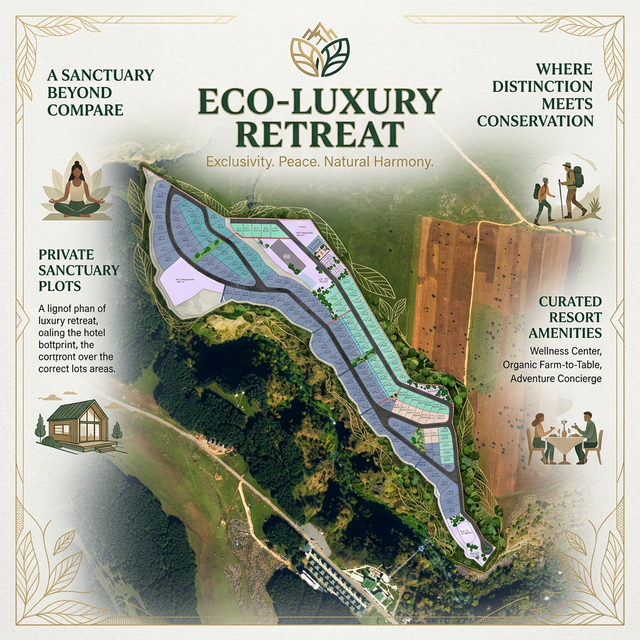
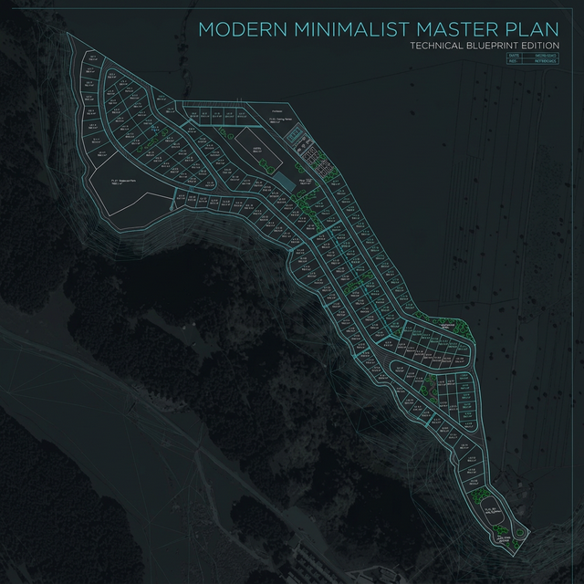
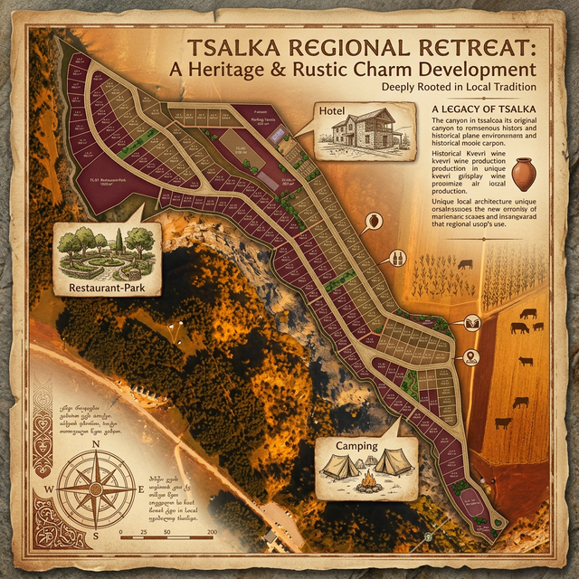
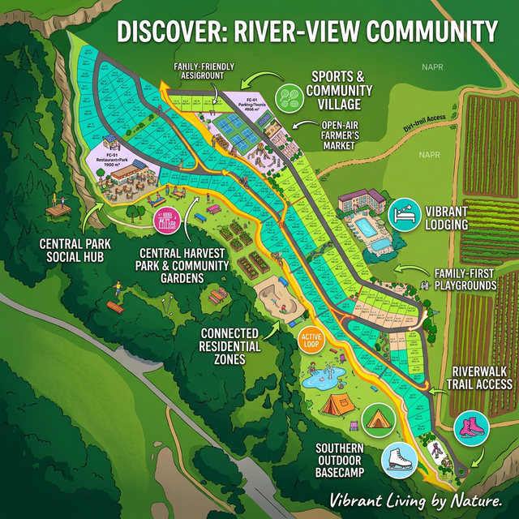
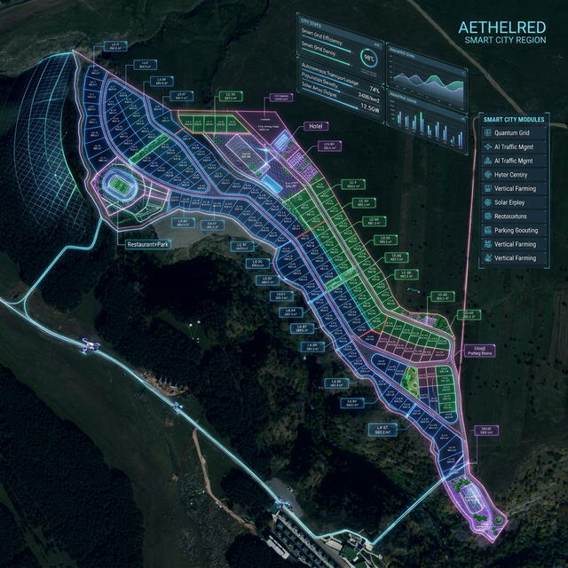
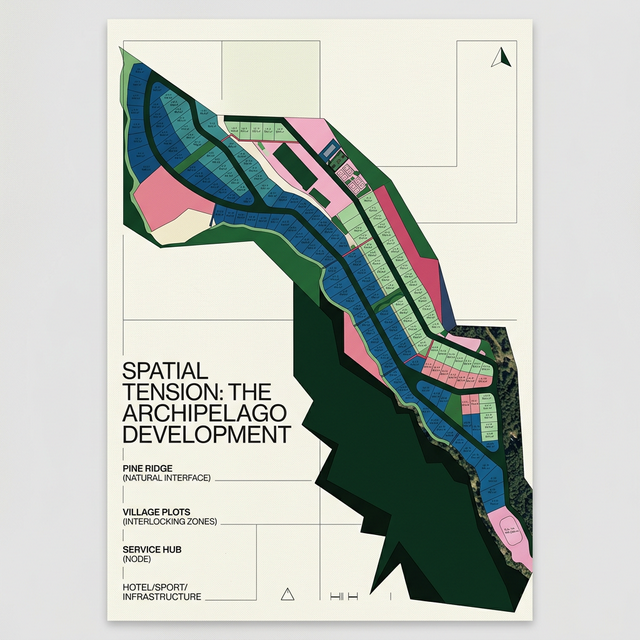

# Tsalka Master Plan: Marketing Visual Concepts (V2 - Clean Master Plan)

Here are 6 distinct selling styles developed for the marketing of the Tsalka project using the clean master plan (without topography lines) and satellite imagery, interpreted through varying design philosophies.

## 1. Eco-Luxury Retreat
**Concept:** Emphasizes the lush green surroundings and natural harmony. A premium aesthetic conveying exclusivity, peace, and seamless integration with nature.
**Target Audience:** High-net-worth individuals seeking privacy, sustainability, and harmony with nature.

## 2. Modern Minimalist
**Concept:** A sleek, precise, architectural blueprint aesthetic. Uses clean geometric lines, stark contrast, and a dark mode aesthetic focusing on precision and high-end modern development.
**Target Audience:** Urban professionals, architecture enthusiasts, and those who appreciate cutting-edge design.

## 3. Heritage & Rustic Charm
**Concept:** Highlights the historical and regional context of Tsalka with warm earthy tones, textured natural materials, and sunset lighting effects. The mood is timeless and welcoming.
**Target Audience:** Families, retirees, and those seeking a community rooted in tradition and local culture.

## 4. Vibrant Community
**Concept:** Lively, bright, energetic colors highlighting social spaces, connectivity, and active lifestyle elements. A family-friendly and thriving neighborhood presentation.
**Target Audience:** Young families, active individuals, and those looking for a lively social environment.

## 5. Futuristic Smart City
**Concept:** A forward-looking, high-tech aesthetic incorporating glowing neon lines and data-driven overlays over dark terrain. Represents the "city of tomorrow" constructed on the landscape.
**Target Audience:** Tech investors, innovators, and early adopters of smart living technologies.

## 6. Abstract Canvas Design
**Concept:** A highly conceptual, museum-quality abstract poster expressing spatial tension. Minimalist text, monumental forms, and Swiss formalism exploring the aesthetic philosophy of the development.
**Target Audience:** Art collectors, design purists, and avant-garde investors looking for statement properties.

